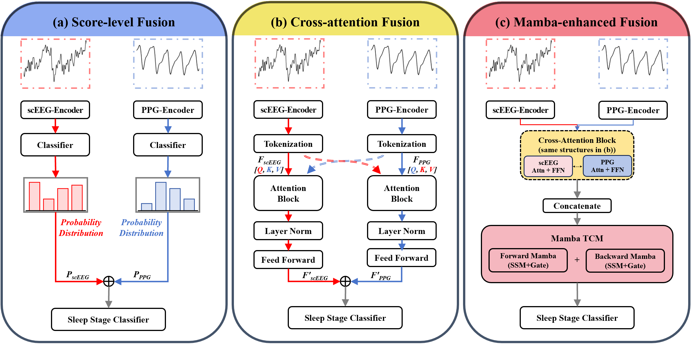
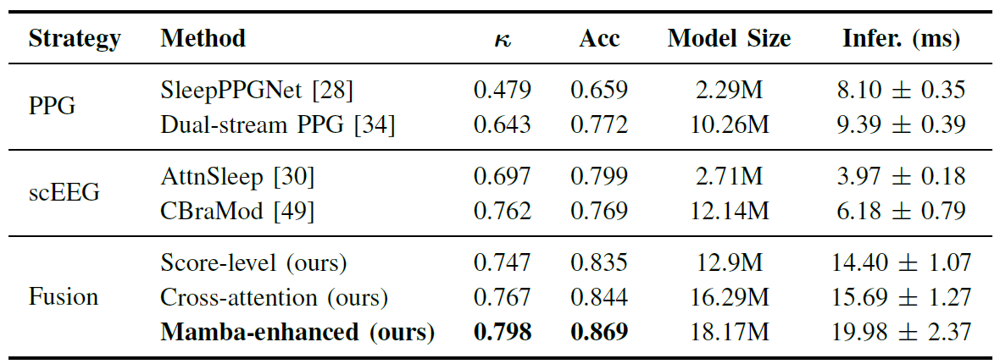
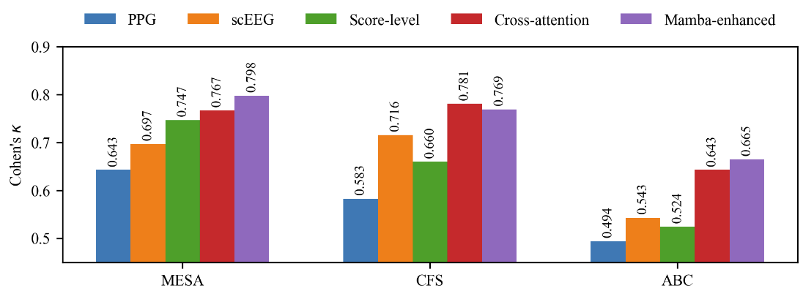

# Combining scEEG and PPG for Reliable Sleep Staging Using Lightweight Wearables

This repository contains the official implementation for ours paper:

> **Combining scEEG and PPG for reliable sleep staging using lightweight wearables**

## Overview
We investigate the fusion of single-channel EEG (scEEG) and photoplethysmography (PPG) for 4-class sleep staging (Wake, Light Sleep, Deep Sleep, REM) under short-window (30s–30min) constraints, with a particular focus on improving Light Sleep classification—a historically challenging stage due to its transitional nature and subtle physiological signatures. Three fusion strategies are proposed and compared:

- **Score-level fusion**: Weighted probability combination of independently trained scEEG and PPG models
- **Cross-attention fusion**: Bidirectional feature-level interactions between modalities via multi-head cross-attention
- **Mamba-enhanced fusion**: Cross-attention fusion augmented with bidirectional Mamba temporal context modeling

The Mamba-enhanced fusion achieves the best performance on the MESA dataset (Cohen's κ = 0.798, Accuracy = 86.9%), with notably improved light sleep classification (F1: 85.63% vs. 77.76% compared to scEEG alone).
  <p align="center">
    
  </p>


## Datasets

We use three publicly available datasets from the [National Sleep Research Resource (NSRR)](https://sleepdata.org/):

| Dataset | Subjects | Age (mean) | Description |
|---------|----------|------------|-------------|
| [MESA](https://sleepdata.org/datasets/mesa) | 2,056 | 69.4 yrs | Training & primary evaluation |
| [CFS](https://sleepdata.org/datasets/cfs) | 719 | 41.2 yrs | Cross-dataset validation |
| [ABC](https://sleepdata.org/datasets/abc) | 49 | 48.2 yrs | Cross-dataset validation (clinical) |

> **Note**: Raw data must be downloaded from NSRR with an approved data access agreement.

### Data Preprocessing

**scEEG**:
- Bandpass filter: 0.3–35 Hz
- Resample to 100 Hz → 3,000 samples/epoch (30s)
- Derivation: C4-M1 (MESA), C3-M2 (CFS, ABC)

**PPG**:
- Lowpass filter: 8 Hz (8th-order Chebyshev Type II)
- Resample to 34.13 Hz → 1,024 samples/epoch (30s)
- Clip values beyond ±3 SD
- Recording-level z-score normalization

## Requirements

```
torch>=2.0.0
numpy>=1.21.0
scipy>=1.7.0
scikit-learn>=1.0.0
h5py>=3.0.0
mne>=1.0.0
tqdm>=4.60.0
pandas>=1.3.0
mamba-ssm>=1.0.0  #For Mamba-enhanced fusion
```

Install dependencies:
```bash
pip install -r requirements.txt
```

## Usage

### 1. Train Individual Models on MESA

```bash
# Train scEEG AttnSleep model
python train/train_evaluate_single_eeg_window.py --window_minutes 3

# Train dual-stream PPG model
python train/ppg_crossattn_shortwindow.py --window_minutes 3
```

### 2. Train Fusion Models on MESA

```bash
# Train score-level fusion
python train/train_score_fusion.py \
    --ppg_model path/to/ppg_model.pth \
    --eeg_model path/to/eeg_model.pth

# Train cross-attention fusion
python train/train_cross_attention_fusion.py
    --ppg_model path/to/ppg_model.pth \
    --eeg_model path/to/eeg_model.pth

# Train Mamba-enhanced fusion
python train/train_mamba_fusion_mesa.py
    --ppg_model path/to/ppg_model.pth \
    --eeg_model path/to/eeg_model.pth
```

### 3. Cross-dataset Validation

#### 3.1 Data Preprocessing
```bash
# CFS dataset - EEG and PPG preprocessing
python cross-dataset/cfs/eeg_data_processing.py
python cross-dataset/cfs/cfs_dataset.py

# ABC dataset - EEG and PPG preprocessing
python cross-dataset/abc/prepare_abc_eeg.py
python cross-dataset/abc/prepare_abc_ppg.py
```

#### 3.2 Zero-shot Evaluation (Without Fine-tuning)
```bash
# CFS dataset
python cross-dataset/cfs/cross_dataset_eeg_evaluation.py      # scEEG zero-shot
python cross-dataset/cfs/cross_dataset_dualppg_evaluation.py  # PPG zero-shot

# ABC dataset
python cross-dataset/abc/eval_eeg__zeroshot_abc.py            # scEEG zero-shot
python cross-dataset/abc/eval_dual_ppg_zeroshot_abc.py        # PPG zero-shot
```

#### 3.3 Fine-tuning on Target Dataset
```bash
# CFS dataset - Fine-tune individual models
python cross-dataset/cfs/finetune_eeg_on_cfs.py               # scEEG fine-tuning
python cross-dataset/cfs/finetune_dual_ppg_on_cfs.py          # PPG fine-tuning

# ABC dataset - Fine-tune individual models
python cross-dataset/abc/finetune_eeg_on_abc.py               # scEEG fine-tuning
python cross-dataset/abc/finetune_dual_ppg_on_abc.py          # PPG fine-tuning
```

#### 3.4 Fusion Model Evaluation on Cross-dataset
```bash
# Score-level fusion
python cross-dataset/cfs/cfs_score_fusion_short_window.py     # CFS
python cross-dataset/abc/abc_score_fusion_short_window.py     # ABC

# Cross-attention fusion fine-tuning
python cross-dataset/cfs/finetune_cross_atten.py              # CFS
python cross-dataset/abc/finetune_cross_atten.py              # ABC

# Mamba-enhanced fusion fine-tuning
python cross-dataset/cfs/finetune_mamba_fusion.py             # CFS
python cross-dataset/abc/finetune_mamba_fusion.py             # ABC
```


## Results

### MESA Dataset (3-minute window)

  <p align="center">
    
  </p>


### Cross-dataset Generalization

  <p align="center">
    
  </p>
  
## Acknowledgments

- Data provided by the [National Sleep Research Resource (NSRR)](https://sleepdata.org/)
- EEG baseline adapted from [Eldele et al., 2021](https://github.com/emadeldeen24/AttnSleep)
- PPG baseline adapted from [Wang et al., 2025](https://github.com/DavyWJW/sleep-staging-models)

## Citation

If you find this work useful, please cite:(coming soon)
```bibtex
@article{wang2026combining,
  title={Combining scEEG and PPG for reliable sleep staging using lightweight wearables},
  author={Wang, Jiawei and Xu, Liang and Zheng, Shuntian and Guan, Yu and Wang, Kaichen and Zhang, Ziqing and Chen, Chen and Yang, Laurence T and Gu, Sai},
  journal={arXiv preprint arXiv:2602.15042},
  year={2026}
}
```

This work builds upon the following studies:
```bibtex
@article{eldele2021attention,
  author={Eldele, Emadeldeen and Chen, Zhenghua and Liu, Chengyu and Wu, Min and Kwoh, Chee-Keong and Li, Xiaoli and Guan, Cuntai},
  journal={IEEE Transactions on Neural Systems and Rehabilitation Engineering},
  title={An Attention-based Deep Learning Approach for Sleep Stage Classification with Single-Channel EEG},
  year={2021},
  volume={29},
  pages={809-818},
  doi={10.1109/TNSRE.2021.3076234}
}
```
```bibtex
@inproceedings{wang2025improving,
  title={On Improving PPG-Based Sleep Staging: A Pilot Study},
  author={Wang, Jiawei and Guan, Yu and Chen, Chen and Zhou, Ligang and Yang, Laurence T and Gu, Sai},
  booktitle={Companion of the 2025 ACM International Joint Conference on Pervasive and Ubiquitous Computing},
  pages={1640--1644},
  year={2025}
}
```

## License

This project is licensed under the MIT License.

